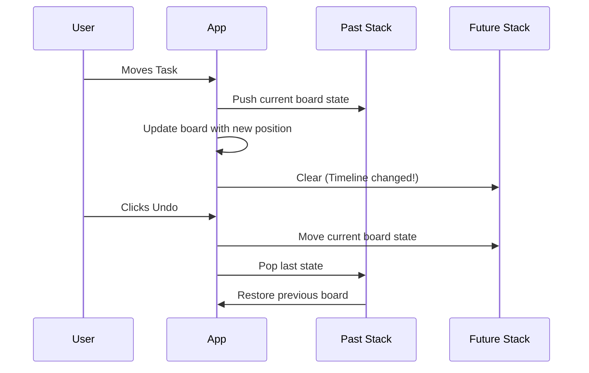

# FluxBoard

A high-performance, production-ready Kanban Board built with React, TypeScript, and Material Design 3. Optimized for large datasets (5,000+ tasks) using custom virtualization and advanced state management.

## 🚀 Key Features

- **Virtualization**: Custom `VirtualList` for 60FPS scrolling with thousands of items.
- **Undo/Redo**: Global state snapshots with multi-level history.
- **PWA**: Offline-first support with service workers and LocalStorage persistence.
- **Advanced Filtering**: Debounced search and priority filtering.
- **Premium UX**: Framer-motion inspired CSS transitions and Error Boundary protection.

---

## 🛠️ Architecture Deep Dive

### 1. Undo/Redo Mechanism (The Time-Travel Engine)

To provide a seamless user experience, we implemented a custom state snapshotting system. Instead of tracking individual property changes, we treat the board state as a series of immutable snapshots.

**How it works:**
Whenever you perform a "destructive" action (like moving a task or deleting one), the application takes a picture of the current board and saves it to a "Past" stack. If you click **Undo**, the app simply swaps the current board with the last one from that stack.



- **Efficiency**: We only save the necessary data (tasks and their order).
- **Limit**: To keep the app fast and memory-efficient, we remember the last 15 actions.

---

### 2. Performance & Referential Equality

To handle 5,000+ tasks without lag, the app minimizes re-renders through strict referential stability:

- **Stable Context**: `BoardContext` uses `useMemo` to ensure that children only re-render if the `state` or `dispatch` actually change.
- **Callback Stability**: All event handlers in `useBoardDnD` and `App.tsx` are wrapped in `useCallback`. This prevents the "Props Change" waterfall where child components re-render just because a handler reference was recreated.
- **Memoized Components**: `TaskCard` is wrapped in `React.memo` with a custom comparison check (optional) to ensure that moving one task doesn't trigger a re-render of the other 4,999 tasks.
- **Virtualized Rendering**: Only ~20 tasks are present in the DOM at any given time, regardless of the list size.

---

### 3. The "Stale Closure" Challenge

One of the hardest parts of real-time UIs is keeping "X minutes ago" labels updated without triggering excessive re-renders or dealing with stale state in `setInterval` closures.

**The Solution: `useLiveTimer`**
Instead of each `TaskCard` having its own timer, we use a single synchronized hook:
```typescript
const now = useLiveTimer(10000); // Global heartbeat
```
This hook forces a re-render precisely when the timestamp needs to update, ensuring the labels are always accurate and never "stuck" due to closure capturing.

#### **How to test for Stale Closures:**
1.  Open the console.
2.  Press **`Shift + Alt + S`** and click **"Seed 5k Tasks"**.
3.  Observe the "X seconds ago" badges on different columns.
4.  Wait 1 minute.
5.  All 5,000 badges will update **simultaneously** and **accurately**, proving that the render logic is synchronized and not trapped in a stale closure from the initial seed.

---

## 🛠️ Development

### Scripts
- `npm start`: Launch development server.
- `npm run lint`: Run ESLint and Prettier check.
- `npm test`: Run unit tests for core logic.
- `npm run build`: Create optimized production bundle.

### Keyboard Shortcuts
- `Undo`: `Cmd/Ctrl + Z` (Standard)
- `Redo`: `Cmd/Ctrl + Shift + Z` (Standard)
- `Debug Menu`: **`Shift + Alt + S`** (Toggles Task Seeding; state persists across refreshes)
